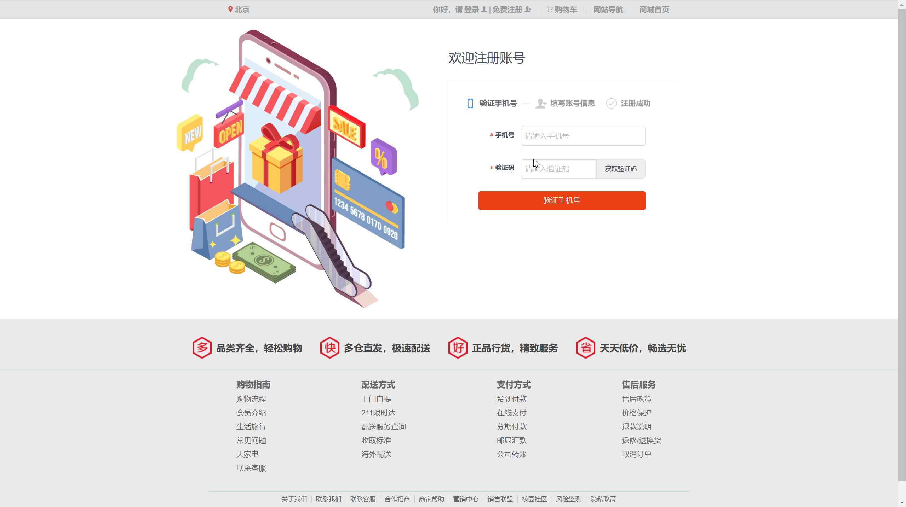
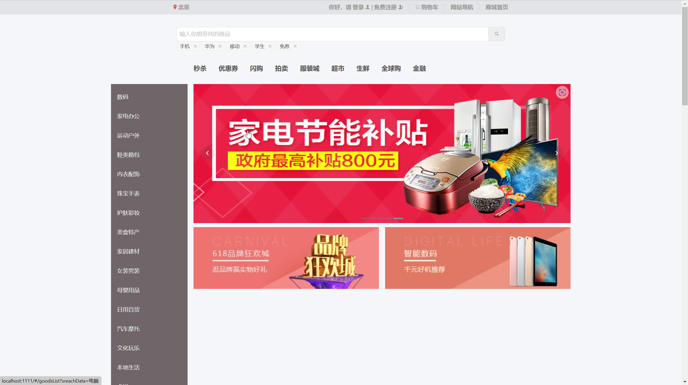
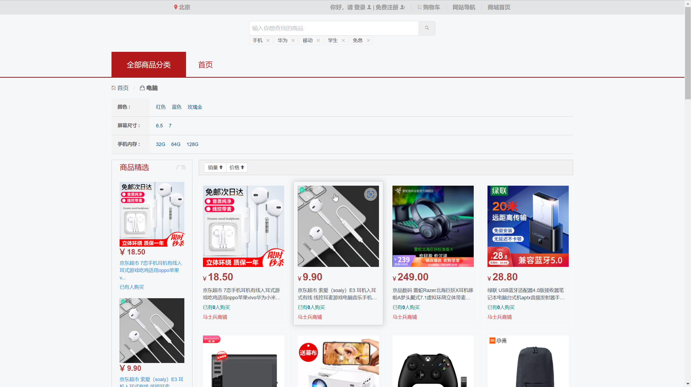
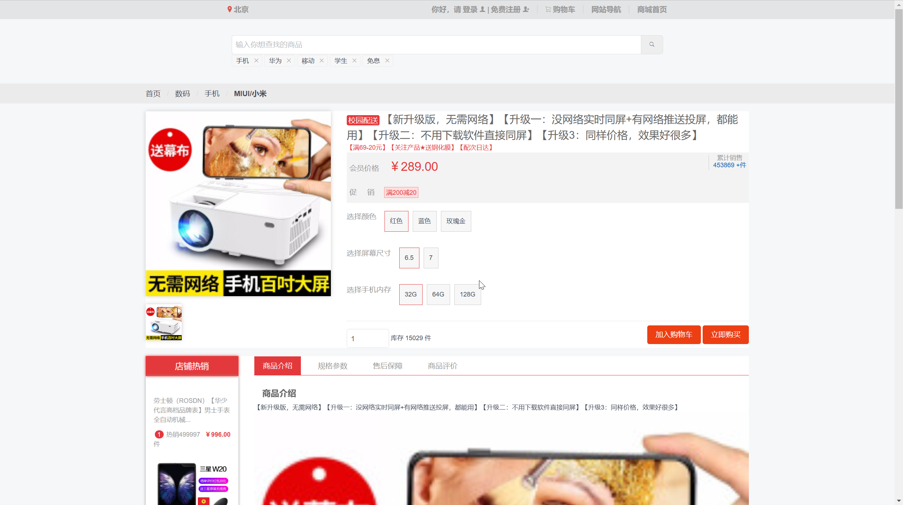

# 仿商城项目

## 一、项目介绍

#### 1. 项目名称
猪猪侠商城

#### 2. 项目功能
- 用户登录注册 包括短信验证码登录
- 商城首页
- 商品详情
- 购物车
- 订单管理
- 用户中心

#### 3. 项目简介
- 前端：vue2 + element-ui + axios + vue-cli3
- 后端：flask全家桶 + mysql + redis + sqlalchemy
- 项目管理：pip
- 项目部署：nginx + uwsgi 
- 项目版本管理：Git
- 项目协作：Github

#### 4. 项目特点
#####  前端
- 采用vue-cli3脚手架搭建项目 主要使用vue2
- 采用axios进行数据请求
- 采用element-ui进行页面布局
- 采用vue-router进行路由管理
- 采用vuex进行状态管理
- 采用vue-lazyload进行图片懒加载
#####  后端
- 采用flask框架进行后端开发 语言是python
- 采用flask-sqlalchemy进行数据库操作
- 采用flask-migrate进行数据库迁移
- 采用flask-redis进行redis操作
- 采用flask-jwt-extended进行token认证
- 采用flask-cors进行跨域请求
- 采用flask-restful进行api接口开发
- 引入sms-sdk进行短信验证码发送
- 自定义装饰器，钩子函数等进行拦截校验

## 二、项目演示
**由于短信接口收费，就不放演示地址了** 
- 注册 
- 首页 
- 概览 
- 详情 

## 三、项目启动
### 前端
#### 本地启动
1. 安装node.js >=14
2. 安装vue-cli3
3. 安装依赖
```
npm install
npm run dev
```
#### 部署
1. 安装nginx
2. 安装node.js >=14
3. 使用命令打包 将打包好的dist文件夹放到nginx的html目录下 进行相关配置即可
```
npm run build
```

### 后端
#### 本地启动
1. 安装python >=3.6
2. 将requirements.txt中的依赖安装到虚拟环境中 进行相关配置 启动即可
```
pip install -r requirements.txt
python app.py runserver
```
#### 部署
1. 安装python >=3.6 最好创建虚拟环境
2. 安装nginx
3. 安装mysql, redis
4. 将requirements.txt中的依赖安装到虚拟环境中 其中包含uwsgi
5. 修改config.py中的配置 并配置nginx uwsgi 启动即可
```
pip install -r requirements.txt
uwsgi --ini uwsgi.ini
```
